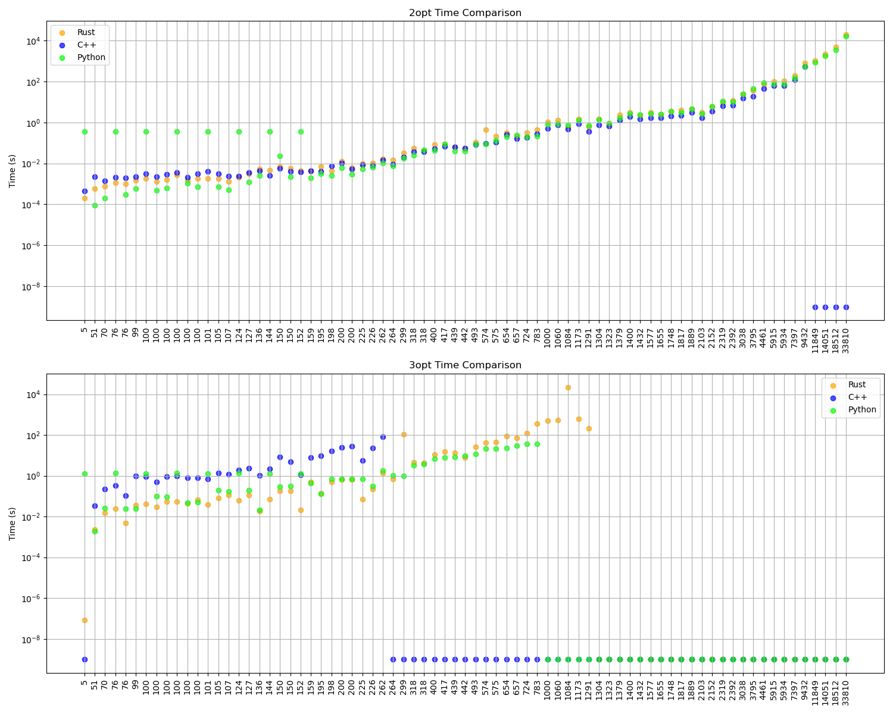
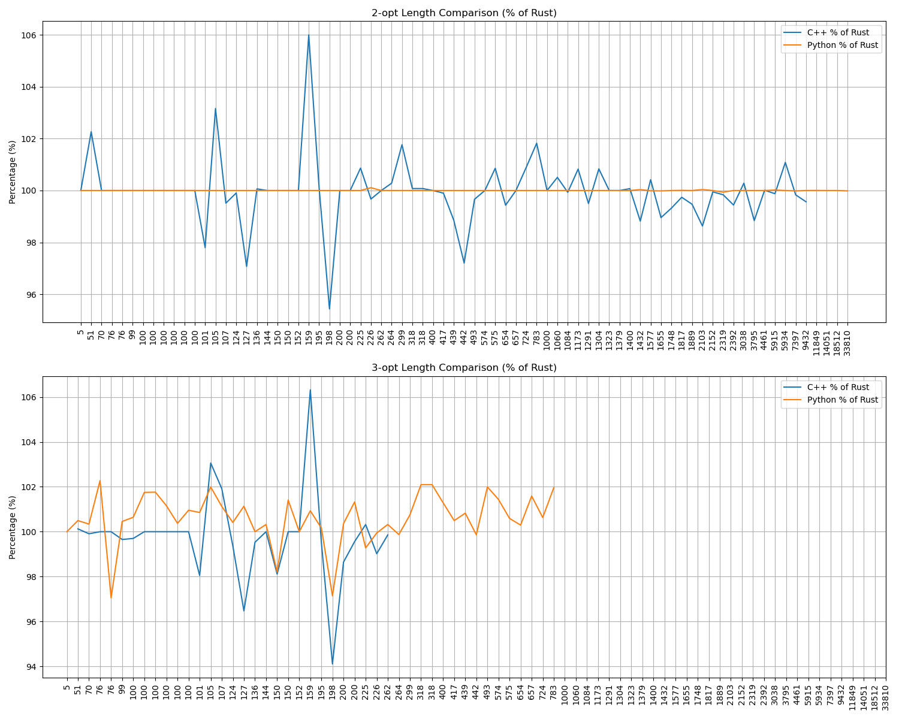

# TSP Algorithm Performance Comparison

## Overview
This document compares 2-opt and 3-opt implementations in Rust, C++, and Python.

## Results Summary

## Detailed Results
| File | Rust (2opt) | C++ (2opt) | Python (2opt) | Rust (3opt) | C++ (3opt) | Python (3opt) |
|------|------------|------------|---------------|------------|------------|---------------|
| tsp_5_1 | 4.00 / 0.0002s | 4.00 / 0.0005s | 4.00 / 0.3599s | 4.00 / 0.0000s | - / - | 4.00 / 1.2674s | 
| tsp_51_1 | 447.73 / 0.0006s | 457.87 / 0.0022s | 447.73 / 0.0001s | 440.94 / 0.0023s | 441.50 / 0.0346s | 443.13 / 0.0019s | 
| tsp_70_1 | 696.33 / 0.0008s | 696.33 / 0.0014s | 696.33 / 0.0002s | 691.28 / 0.0147s | 690.65 / 0.2205s | 693.62 / 0.0266s | 
| tsp_76_1 | 589.61 / 0.0012s | 589.61 / 0.0021s | 589.61 / 0.3610s | 570.58 / 0.0234s | 570.58 / 0.3338s | 583.57 / 1.3200s | 
| tsp_76_2 | 115716.15 / 0.0010s | 115716.15 / 0.0020s | 115716.15 / 0.0003s | 115276.44 / 0.0049s | 115276.44 / 0.1047s | 111878.21 / 0.0244s | 
| tsp_99_1 | 1314.19 / 0.0015s | 1314.19 / 0.0022s | 1314.19 / 0.0006s | 1279.65 / 0.0355s | 1275.21 / 0.9843s | 1285.49 / 0.0243s | 
| tsp_100_2 | 23224.14 / 0.0014s | 23224.14 / 0.0022s | 23224.14 / 0.0005s | 22725.38 / 0.0294s | 22725.38 / 0.4839s | 23123.15 / 0.0972s | 
| tsp_100_3 | 22539.10 / 0.0016s | 22539.10 / 0.0030s | 22539.10 / 0.0006s | 22148.52 / 0.0538s | 22148.52 / 0.8966s | 22539.10 / 0.0946s | 
| tsp_100_4 | 21846.81 / 0.0027s | 21846.81 / 0.0035s | 21846.81 / 0.3636s | 21597.17 / 0.0532s | 21597.17 / 0.9822s | 21846.81 / 1.3263s | 
| tsp_100_5 | 22865.68 / 0.0015s | 22865.68 / 0.0021s | 22865.68 / 0.0011s | 22621.82 / 0.0436s | 22621.82 / 0.7959s | 22706.13 / 0.0469s | 
| tsp_100_1 | 22148.77 / 0.0018s | 22148.77 / 0.0032s | 22148.77 / 0.3651s | 21362.98 / 0.0419s | 21298.98 / 0.8939s | 21500.28 / 1.2989s | 
| tsp_100_6 | 8565.53 / 0.0018s | 8565.53 / 0.0030s | 8565.53 / 0.0007s | 8374.46 / 0.0674s | 8374.46 / 0.8165s | 8454.51 / 0.0499s | 
| tsp_101_1 | 685.76 / 0.0018s | 670.65 / 0.0041s | 685.76 / 0.3565s | 678.13 / 0.0382s | 664.90 / 0.7071s | 683.94 / 1.2737s | 
| tsp_105_1 | 15520.89 / 0.0019s | 16011.27 / 0.0032s | 15520.89 / 0.0007s | 15126.66 / 0.0820s | 15589.49 / 1.3940s | 15427.81 / 0.1904s | 
| tsp_107_1 | 46546.93 / 0.0013s | 46320.12 / 0.0024s | 46546.93 / 0.0005s | 44782.41 / 0.1133s | 45640.50 / 1.1634s | 45286.71 / 0.1671s | 
| tsp_124_1 | 60366.11 / 0.0021s | 60308.25 / 0.0023s | 60366.11 / 0.3641s | 59928.92 / 0.0603s | 59547.46 / 1.8460s | 60175.53 / 1.4056s | 
| tsp_127_1 | 129060.75 / 0.0031s | 125282.93 / 0.0035s | 129060.75 / 0.0012s | 127610.44 / 0.1155s | 123110.37 / 2.3823s | 129060.75 / 0.1957s | 
| tsp_136_1 | 104458.57 / 0.0055s | 104524.66 / 0.0043s | 104458.57 / 0.0025s | 104458.57 / 0.0182s | 103967.95 / 1.0205s | 104458.57 / 0.0217s | 
| tsp_144_1 | 59545.41 / 0.0048s | 59545.41 / 0.0026s | 59545.41 / 0.3607s | 59354.42 / 0.0732s | 59354.42 / 2.1696s | 59545.41 / 1.2833s | 
| tsp_150_1 | 28427.69 / 0.0071s | 28427.69 / 0.0058s | 28427.69 / 0.0235s | 28289.03 / 0.1787s | 27754.59 / 8.3879s | 27782.48 / 0.2992s | 
| tsp_150_2 | 27416.35 / 0.0058s | 27416.35 / 0.0042s | 27416.35 / 0.0022s | 26876.02 / 0.1801s | 26876.02 / 4.9674s | 27255.35 / 0.3114s | 
| tsp_152_1 | 74461.66 / 0.0043s | 74461.66 / 0.0039s | 74461.66 / 0.3632s | 74461.66 / 0.0214s | 74461.66 / 1.0948s | 74461.66 / 1.3100s | 
| tsp_159_1 | 43743.19 / 0.0041s | 46367.24 / 0.0043s | 43743.19 / 0.0020s | 42948.16 / 0.5019s | 45660.82 / 7.6719s | 43347.80 / 0.4423s | 
| tsp_195_1 | 2373.90 / 0.0071s | 2376.37 / 0.0040s | 2373.90 / 0.0031s | 2369.65 / 0.1388s | 2358.19 / 9.7231s | 2373.45 / 0.1333s | 
| tsp_198_1 | 17244.83 / 0.0044s | 16457.83 / 0.0073s | 17244.83 / 0.0025s | 17124.54 / 0.5122s | 16116.43 / 16.8784s | 16635.67 / 0.6905s | 
| tsp_200_1 | 31289.58 / 0.0132s | 31289.58 / 0.0105s | 31289.58 / 0.0063s | 30650.55 / 0.6726s | 30235.69 / 25.2329s | 30761.35 / 0.6920s | 
| tsp_200_2 | 32475.13 / 0.0062s | 32475.13 / 0.0054s | 32475.13 / 0.0030s | 31891.04 / 0.6358s | 31749.89 / 28.1031s | 32313.72 / 0.7037s | 
| tsp_225_1 | 128002.41 / 0.0099s | 129109.17 / 0.0087s | 128002.41 / 0.0052s | 128002.41 / 0.0696s | 128410.19 / 5.5000s | 127079.25 / 0.6794s | 
| tsp_226_1 | 83602.92 / 0.0106s | 83326.58 / 0.0080s | 83692.43 / 0.0067s | 83507.34 / 0.2262s | 82688.40 / 22.5200s | 83459.46 / 0.3151s | 
| tsp_262_1 | 2529.91 / 0.0170s | 2529.91 / 0.0145s | 2529.91 / 0.0104s | 2517.89 / 1.3810s | 2514.32 / 81.3331s | 2526.02 / 1.7258s | 
| tsp_264_1 | 51848.86 / 0.0145s | 51995.22 / 0.0090s | 51848.86 / 0.0077s | 51637.57 / 0.6827s | - / - | 51572.08 / 1.0298s | 
| tsp_299_1 | 50547.75 / 0.0325s | 51440.38 / 0.0206s | 50547.75 / 0.0183s | 49702.61 / 110.3090s | - / - | 50075.44 / 0.9950s | 
| tsp_318_1 | 44814.85 / 0.0562s | 44848.29 / 0.0379s | 44814.85 / 0.0257s | 43694.45 / 4.5403s | - / - | 44609.87 / 3.2029s | 
| tsp_318_2 | 44814.85 / 0.0438s | 44848.29 / 0.0383s | 44814.85 / 0.0451s | 43694.45 / 4.3970s | - / - | 44609.87 / 3.6102s | 
| tsp_400_1 | 16383.24 / 0.0815s | 16383.24 / 0.0513s | 16383.24 / 0.0426s | 16089.32 / 11.2536s | - / - | 16296.52 / 6.8015s | 
| tsp_417_1 | 12232.31 / 0.0826s | 12219.83 / 0.0680s | 12232.31 / 0.0914s | 12141.55 / 15.0750s | - / - | 12201.57 / 7.9815s | 
| tsp_439_1 | 114946.51 / 0.0620s | 113628.55 / 0.0633s | 114946.51 / 0.0390s | 113096.13 / 13.2979s | - / - | 114031.13 / 8.2421s | 
| tsp_442_1 | 54224.34 / 0.0507s | 52706.56 / 0.0576s | 54224.34 / 0.0407s | 53566.21 / 7.5612s | - / - | 53491.89 / 9.2687s | 
| tsp_493_1 | 37399.21 / 0.1083s | 37272.43 / 0.0814s | 37399.21 / 0.0895s | 36668.00 / 26.7870s | - / - | 37399.21 / 11.8401s | 
| tsp_574_1 | 40125.93 / 0.4322s | 40125.93 / 0.0961s | 40125.93 / 0.0892s | 39556.92 / 40.6378s | - / - | 40125.93 / 21.0752s | 
| tsp_575_1 | 7203.85 / 0.2108s | 7265.57 / 0.1093s | 7203.85 / 0.1364s | 7097.86 / 45.1020s | - / - | 7139.93 / 20.9133s | 
| tsp_654_1 | 36644.90 / 0.3090s | 36436.87 / 0.2620s | 36644.90 / 0.2026s | 35897.74 / 85.2783s | - / - | 36003.56 / 23.6319s | 
| tsp_657_1 | 51794.31 / 0.2181s | 51794.31 / 0.1602s | 51794.31 / 0.2490s | 51033.00 / 72.0127s | - / - | 51844.08 / 30.9370s | 
| tsp_724_1 | 44149.43 / 0.3169s | 44546.66 / 0.1841s | 44149.43 / 0.2044s | 43572.95 / 122.1451s | - / - | 43847.13 / 37.3423s | 
| tsp_783_1 | 9383.93 / 0.4509s | 9554.94 / 0.2730s | 9383.93 / 0.2182s | 9203.36 / 364.9815s | - / - | 9383.93 / 36.9201s | 
| tsp_1000_1 | 20095327.22 / 1.0590s | 20095327.22 / 0.5143s | 20095327.22 / 0.8006s | 19765087.99 / 489.5779s | - / - | - / - | 
| tsp_1060_1 | 239059.24 / 1.3237s | 240266.67 / 0.7573s | 239059.24 / 0.8530s | 236556.34 / 555.4651s | - / - | - / - | 
| tsp_1084_1 | 258880.61 / 0.6334s | 258698.97 / 0.4870s | 258880.61 / 0.7516s | 254582.37 / 22128.6452s | - / - | - / - | 
| tsp_1173_1 | 61257.85 / 1.5134s | 61762.85 / 0.8908s | 61257.85 / 1.2576s | 60459.74 / 607.3233s | - / - | - / - | 
| tsp_1291_1 | 54719.81 / 0.6137s | 54445.01 / 0.3548s | 54719.81 / 0.7254s | 54548.62 / 207.3811s | - / - | - / - | 
| tsp_1304_1 | 272887.58 / 1.5182s | 275165.04 / 0.7675s | 272887.58 / 1.4278s | - / - | - / - | - / - | 
| tsp_1323_1 | 285332.05 / 0.8171s | 285338.94 / 0.6639s | 285332.05 / 0.9328s | - / - | - / - | - / - | 
| tsp_1379_1 | 60228.28 / 2.4288s | 60228.28 / 1.2868s | 60228.28 / 1.7297s | - / - | - / - | - / - | 
| tsp_1400_1 | 21786.24 / 3.1410s | 21801.90 / 1.8818s | 21786.24 / 2.6428s | - / - | - / - | - / - | 
| tsp_1432_1 | 164931.61 / 2.4286s | 162983.06 / 1.4839s | 164990.19 / 2.3270s | - / - | - / - | - / - | 
| tsp_1577_1 | 22812.81 / 3.0196s | 22907.73 / 1.6927s | 22810.76 / 2.7063s | - / - | - / - | - / - | 
| tsp_1655_1 | 67050.29 / 2.6160s | 66349.45 / 1.6821s | 67040.79 / 2.4883s | - / - | - / - | - / - | 
| tsp_1748_1 | 363762.53 / 3.5133s | 361281.59 / 2.0514s | 363762.53 / 3.4218s | - / - | - / - | - / - | 
| tsp_1817_1 | 61915.07 / 4.0171s | 61753.35 / 2.2319s | 61919.59 / 3.0457s | - / - | - / - | - / - | 
| tsp_1889_1 | 337843.89 / 4.6842s | 336053.48 / 3.0203s | 337843.89 / 4.7153s | - / - | - / - | - / - | 
| tsp_2103_1 | 84519.21 / 3.0590s | 83361.30 / 1.7242s | 84551.24 / 2.6513s | - / - | - / - | - / - | 
| tsp_2152_1 | 69798.11 / 6.0101s | 69761.53 / 3.4607s | 69798.11 / 5.8760s | - / - | - / - | - / - | 
| tsp_2319_1 | 242634.10 / 9.9307s | 242236.07 / 6.3720s | 242481.31 / 11.3447s | - / - | - / - | - / - | 
| tsp_2392_1 | 403471.74 / 12.1409s | 401211.05 / 6.9185s | 403471.74 / 10.1473s | - / - | - / - | - / - | 
| tsp_3038_1 | 147332.94 / 25.3958s | 147748.46 / 15.4363s | 147332.94 / 24.4324s | - / - | - / - | - / - | 
| tsp_3795_1 | 29915.46 / 36.1206s | 29567.90 / 19.4384s | 29915.46 / 44.2797s | - / - | - / - | - / - | 
| tsp_4461_1 | 194557.81 / 72.8557s | 194580.70 / 43.5614s | 194557.81 / 87.2442s | - / - | - / - | - / - | 
| tsp_5915_1 | 600333.37 / 97.3995s | 599589.27 / 62.5581s | 600446.96 / 74.5038s | - / - | - / - | - / - | 
| tsp_5934_1 | 585248.38 / 105.9254s | 591587.58 / 63.8290s | 585248.38 / 78.5909s | - / - | - / - | - / - | 
| tsp_7397_1 | 24735838.92 / 196.8774s | 24694323.08 / 123.8793s | 24732684.83 / 154.8645s | - / - | - / - | - / - | 
| tsp_9432_1 | 57631.38 / 802.2075s | 57380.56 / 536.3527s | 57631.38 / 539.1926s | - / - | - / - | - / - | 
| tsp_11849_1 | 973937.69 / 1063.5041s | - / - | 973973.15 / 881.1768s | - / - | - / - | - / - | 
| tsp_14051_1 | 500668.83 / 2231.5200s | - / - | 500668.83 / 1828.5820s | - / - | - / - | - / - | 
| tsp_18512_1 | 687270.15 / 4951.6617s | - / - | 687270.15 / 3510.2956s | - / - | - / - | - / - | 
| tsp_33810_1 | 69887018.63 / 19581.2040s | - / - | 69878014.65 / 16718.7464s | - / - | - / - | - / - | 
